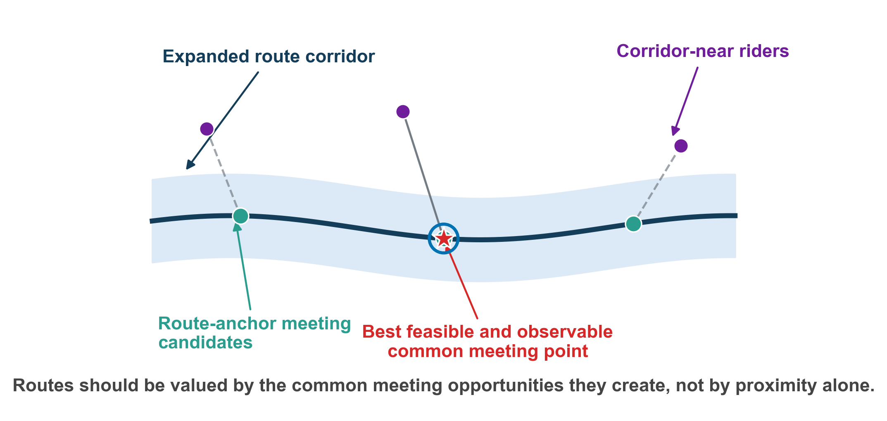
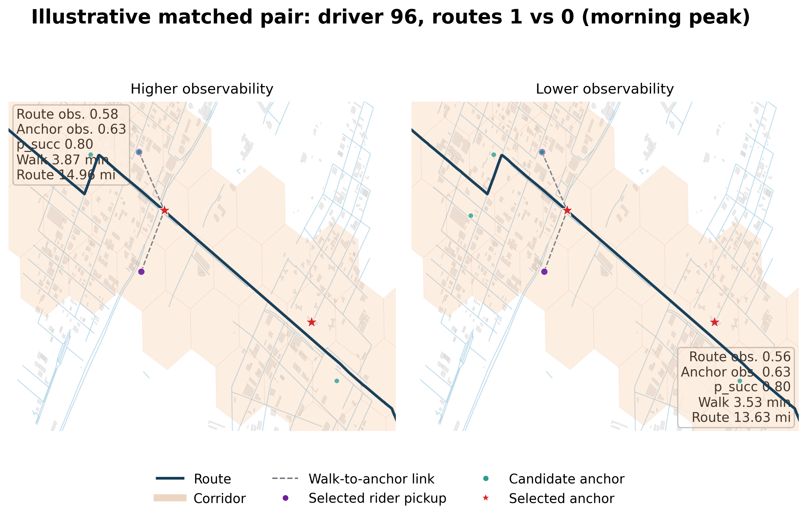
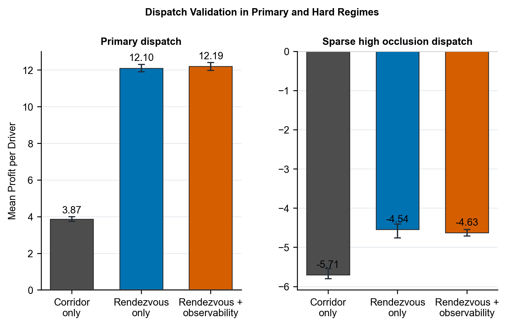
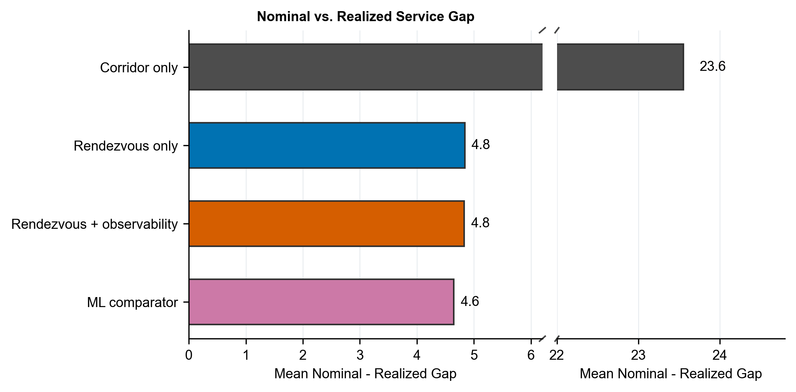

# Rendezvous-Aware Route Choice Under Occlusion

This repository contains the public release for our study of route choice in urban ride-pooling through **feasible** and **observable** rendezvous opportunities. The core question is simple:

> Should routes be valued by corridor proximity alone, or by the common meeting opportunities they actually create under urban occlusion?

The codebase includes the route-evaluation engine, observability-aware meeting-point logic, urban-context processing pipeline, dispatch validation workflow, and the full manuscript package used for submission.

<p align="center">
  
</p>

## Why This Repository Exists

Most route-aware matching heuristics reward routes that pass near many riders. This repository studies a stricter and more operationally meaningful alternative:

- riders must have a **feasible common meeting point** with the route
- those meeting points should remain **legible and reliable** under clutter, turns, sidewalk constraints, and occlusion
- route value should therefore reflect **realizable pickup opportunities**, not raw corridor exposure

## Main Findings

The headline results in the submission snapshot are:

| Setting | Corridor only | Rendezvous only | Rendezvous + observability |
| --- | ---: | ---: | ---: |
| Yellow primary single-driver mean actual profit | 6.73 | 17.55 | 17.49 |
| Yellow sparse high-occlusion single-driver mean actual profit | -3.39 | -0.70 | -0.68 |
| Yellow primary nominal-realized gap | 23.58 | 4.89 | 4.92 |
| Yellow primary dispatch profit per driver | 3.87 | 12.10 | 12.19 |

What this means in practice:

- corridor-only valuation leaves a large amount of realizable value on the table
- rendezvous-aware policies dramatically improve realized value over corridor-only matching
- the observability-aware variant is especially useful in harder urban regimes
- the main contribution is **not** "more route awareness"; it is **valuing feasible and observable rendezvous opportunities correctly**

## Visual Overview

<p align="center">
  
  
</p>

<p align="center">
  
</p>

These figures illustrate three different parts of the story:

- **Concept**: routes should be scored by common meeting opportunities, not corridor membership alone
- **Mechanism**: matched route pairs can look similar in exposure while differing in legibility and anchor quality
- **System-level impact**: the valuation choice still matters once we move from isolated routes to rolling dispatch

## Repository Layout

- `src/rendezvous/`: route evaluation, meeting-point generation, observability proxy, and dispatch validation logic
- `src/data_prep/`: domain preparation, downloads, preprocessing, and urban-context construction
- `src/spatial/`: corridor and routing helpers
- `scripts/`: end-to-end runners for data prep, experiments, figure generation, case-study generation, and package sync
- `results/runs/<run_id>/`: immutable run-scoped artifacts with manifests
- `paper_rendezvous/`: manuscript source package
- `paper_rendezvous_overleaf/`: slim Overleaf-ready package

Local data products such as `data/urban_context/` are generated by the preparation scripts rather than stored in the public repo snapshot.

## Data Sources

The public release is built around openly available data:

- NYC TLC Yellow and Green trip records
- NYC Centerline
- NYC Sidewalk Centerline
- NYC Building Footprints
- NYC PLUTO
- NYC elevation and morphology proxies aggregated to H3

The urban-context stack is used to construct observability and pickup-reliability proxies from local geometry rather than relying on proprietary app telemetry.

## Quick Start

Install dependencies:

```powershell
python -m pip install -r requirements.txt
```

Build the NYC urban-context layer:

```powershell
python scripts\build_urban_context.py --resolution 9
```

Run a small controlled single-driver study:

```powershell
python run_all.py --single-driver-only --sample 250 --seeds 1
```

Run the rolling dispatch validation:

```powershell
python scripts\run_rendezvous_dispatch.py --sample 100 --seeds 1
```

Refresh the paper package end-to-end:

```powershell
python scripts\prepare_rendezvous_submission.py
```

`prepare_rendezvous_submission.py` backfills legacy runs into the registry if needed, rebuilds summaries, regenerates figures and case studies, and synchronizes the Overleaf package.

## Reproducibility

The reproducibility guide lives in [REPRODUCIBILITY.md](REPRODUCIBILITY.md).

Important reproducibility assets include:

- `results/runs/<run_id>/manifest.json`
- `results/runs/<run_id>/rendezvous_driver_summary*.csv`
- `results/runs/<run_id>/rendezvous_dispatch_summary*.csv`
- `paper_rendezvous/figures/`

## Manuscript Package

The paper source is in:

- [paper_rendezvous/ieee_submission.tex](paper_rendezvous/ieee_submission.tex)
- [paper_rendezvous/references.bib](paper_rendezvous/references.bib)

The synchronized Overleaf upload package is in:

- [paper_rendezvous_overleaf/](paper_rendezvous_overleaf/)

## Authors

- **Kaushik Kumar** - University of Arizona, College of Information Science
- **Yogesh Rethinapandian** - University of Illinois Chicago
- **Vikram Raja** - Vels University

## Citation

If you use this repository, please cite the corresponding manuscript in `paper_rendezvous/`.

## License

This repository is released under the [MIT License](LICENSE).
